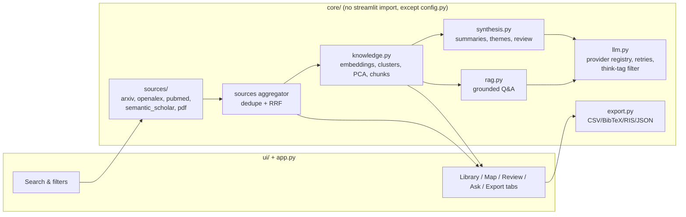

# Research Copilot

A reading-room for literature work: search arXiv, OpenAlex, PubMed and Semantic Scholar (or
upload your own PDFs) in one pass, cluster the results into themes, generate a map-reduce
literature review with numbered citations, chat with the papers (grounded RAG), and export to
CSV/BibTeX/RIS/JSON.

This repo absorbs [Literature-Review-creator](https://github.com/SpandanNagale/Literature-Review-creator)
— PDF upload, the PCA cluster map, and per-cluster synthesis all originated there and now live
here as one app.

## Features

- **Multi-source search** — arXiv, OpenAlex, PubMed, Semantic Scholar, run in parallel; one
  failing source shows a warning instead of killing the run. Cross-source dedupe (DOI → arXiv ID
  → PMID → title) with Reciprocal Rank Fusion ranking, plus sort by recency or citations.
- **PDF upload** — full text kept and chunked for retrieval, not truncated.
- **Clustering & map** — sentence-transformer embeddings (TF-IDF fallback if the model can't
  load), KMeans themes with free TF-IDF keyword labels or an optional one-shot AI naming pass, a
  Plotly PCA scatter colored by theme.
- **Literature review** — map-reduce: one section per theme over its centroid-nearest papers,
  then an Introduction/Research gaps/Conclusion pass. Citation numbers are assigned once, up
  front, so `[n]` stays consistent across every section. Exports to Markdown + matching BibTeX.
- **Ask (RAG chat)** — streaming, grounded answers with sources numbered per paper, a theme
  filter, and short-follow-up query rewriting.
- **Export** — CSV, BibTeX, RIS, JSON.
- **Multi-provider LLM** — Groq, Gemini, OpenRouter, Ollama Cloud, and local Ollama, all through
  one OpenAI-compatible client with live model listing, retries, and readable error messages.

## Architecture



## Setup

```bash
git clone https://github.com/SpandanNagale/Research-Copilot
cd Research-Copilot

python -m venv .venv
.venv\Scripts\activate      # Windows
source .venv/bin/activate   # Linux/Mac

pip install -r requirements.txt
cp .env.example .env        # fill in the keys you have

streamlit run app.py
```

### Where to get each key

| Key | Used for | Get it at |
|---|---|---|
| `GROQ_API_KEY` | LLM | console.groq.com |
| `GEMINI_API_KEY` | LLM | aistudio.google.com/apikey |
| `OPENROUTER_API_KEY` | LLM | openrouter.ai/keys |
| `OLLAMA_API_KEY` | LLM (Ollama Cloud) | ollama.com |
| `OPENALEX_API_KEY` | Data source (required since Feb 2026) | openalex.org |
| `NCBI_API_KEY` + `NCBI_EMAIL` | Data source (PubMed, optional but raises rate limits) | ncbi.nlm.nih.gov/account |
| `SEMANTIC_SCHOLAR_API_KEY` | Data source (optional, raises rate limits) | semanticscholar.org/product/api |
| `APP_PASSWORD` | Gates saved server-side keys on a public deployment | set your own |

None of these are required to start the app — visitors without keys can bring their own from the
sidebar, and data sources work (at lower rate limits) without a key.

### Secrets on Streamlit Cloud

Copy `.streamlit/secrets.toml.example` to `.streamlit/secrets.toml` (already gitignored) and fill
in the same keys, or set them as Secrets in the Streamlit Cloud dashboard. `core/config.py` reads
`st.secrets` first, then falls back to environment variables / `.env`.

Local Ollama (`ollama_local` provider) only works when you run the app on your own machine — it
won't reach `localhost:11434` on the hosted deployment.

## Tests

```bash
pytest
```

All tests are offline (fixtures mirror real API payloads, a `FakeLLM` stands in for every
provider) — no network calls, no real keys needed.
